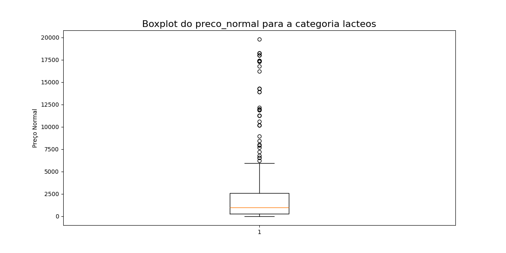
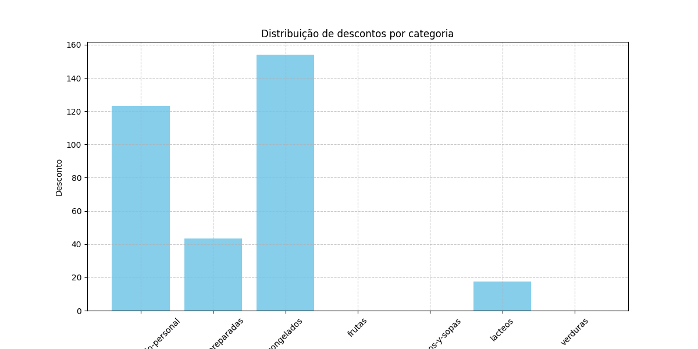
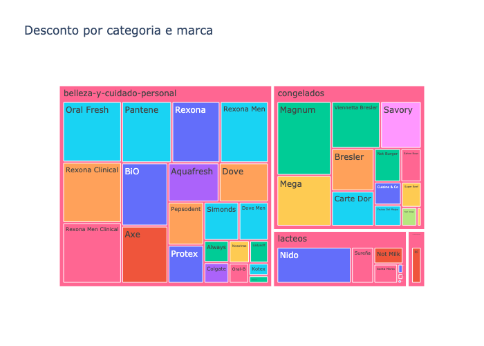

# Análise de Descontos e Preços por Categoria

Este projeto analisa os preços normais e os descontos aplicados em diferentes categorias e marcas. A seguir, apresentamos três gráficos que ilustram os dados, com explicações para públicos distintos: **executivos**, **cientistas de dados** e **curiosos/novatos**.

---

## 1️⃣ Boxplot: Preço Normal para Categoria com Maior Desvio Padrão

### O que este gráfico nos mostra?

- **Executivos**: Este gráfico destaca a variabilidade dos preços na categoria 'Lacteos'. A mediana dos preços é de **120**, e há produtos com preços muito acima da média, sugerindo itens premium ou exclusivos.
  
- **Cientistas de Dados**: O boxplot revela que os 50% centrais dos preços estão concentrados entre **100** e **150**. Outliers acima de **250** são observados, indicando uma distribuição assimétrica.

- **Curiosos/Novatos**: Este gráfico ajuda a entender como os preços se distribuem. A linha no meio representa o preço típico (mediana), enquanto os pontos fora do gráfico são preços excepcionais (outliers).

---

## 2️⃣ Gráfico de Barras: Distribuição de Descontos por Categoria

### O que este gráfico nos mostra?

- **Executivos**: As categorias com os maiores descontos são claramente identificadas. Isso ajuda a priorizar estratégias promocionais para categorias com maior impacto.

- **Cientistas de Dados**: A média de descontos por categoria foi calculada usando `pandas`. O gráfico exibe uma visão clara das categorias que oferecem maior desconto em média, como 'Instantaneos' e 'Congelados'.

- **Curiosos/Novatos**: Cada barra representa uma categoria, e a altura indica o desconto médio. Categorias com barras mais altas têm descontos maiores.

---

## 3️⃣ Treemap: Desconto por Categoria e Marca

### O que este gráfico nos mostra?

- **Executivos**: Este treemap oferece uma visão hierárquica de como as marcas dentro de cada categoria contribuem para os descontos. Categorias maiores representam maior desconto médio.

- **Cientistas de Dados**: O treemap foi gerado com o `plotly.express`, agrupando os dados por categoria e marca, e calculando a média de desconto. A paleta de cores ajuda a diferenciar as marcas.

- **Curiosos/Novatos**: Este gráfico interativo organiza as categorias e marcas de forma visual. O tamanho dos blocos reflete o desconto médio, enquanto as cores ajudam a identificar as marcas.

---

## 🚀 Próximos Passos

1. **Para Executivos:**
   - Use os insights para otimizar estratégias de precificação e descontos.
   - Avalie as oportunidades em categorias com alta variabilidade de preços e descontos elevados.

2. **Para Cientistas de Dados:**
   - Explore outros agrupamentos, como sazonalidade ou regiões.
   - Verifique como outliers podem influenciar os cálculos de média e desvio padrão.

3. **Para Curiosos/Novatos:**
   - Experimente replicar os gráficos modificando os dados.
   - Aprenda mais sobre como gráficos ajudam a contar histórias sobre dados.

---

## 📂 Estrutura do Repositório

- `data/`: Arquivos CSV usados na análise.
- `imagens/`: Gráficos gerados pelo código.
- `notebooks/`: Scripts que você pode executar para reproduzir os resultados.

---

## 🔧 Tecnologias Utilizadas

- **Python**: Processamento de dados com `pandas`.
- **Matplotlib**: Criação de gráficos estáticos.
- **Plotly**: Geração de gráficos interativos.

